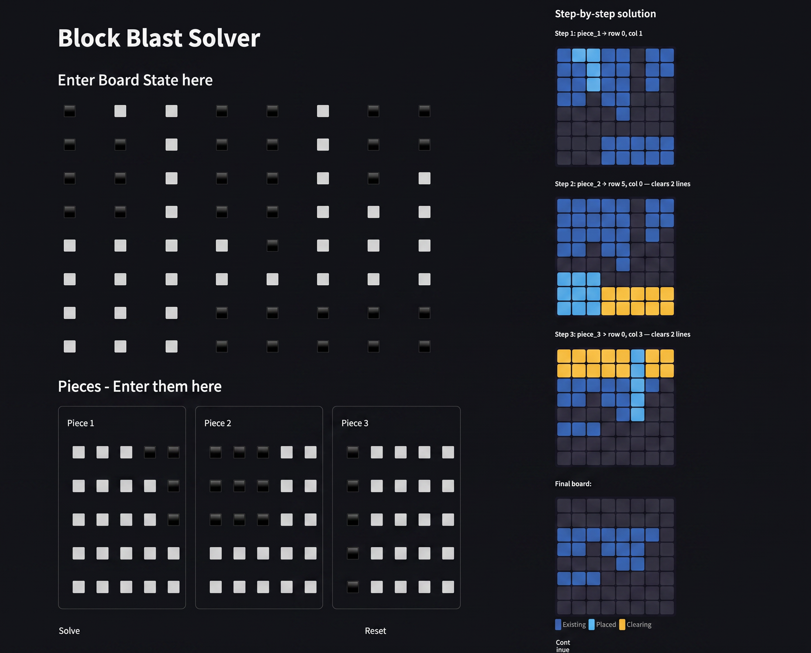

# Block Blast Solver

A solver for the mobile puzzle game Block Blast, built entirely from scratch in Python, because understanding the problem well enough to write the solution is more interesting than having the solution.

You feed it your current board and the three pieces you've been dealt. It figures out the best place to put all of them.

**Live demo:** [blockblastsolver.streamlit.app](https://blockblastsolver.streamlit.app)



---

## How it works

### The solver

The core is a recursive search across all possible piece orderings. Piece placement order matters, since placing one piece can clear a line that opens space for the next, so the solver generates every permutation of the three pieces (up to 3! = 6) and runs a depth-first search for each, trying every valid position on the 8×8 board at every step.

Scoring is `cells placed + lines cleared`, weighted to reward board cleanup. The solver tracks the highest-scoring *complete* sequence, meaning all three pieces placed, and discards any branch that dead-ends.

The board state is represented as a NumPy array throughout. Placement, collision detection, and line clearing all operate directly on these arrays, keeping the logic clean and the operations fast. Line clearing uses NumPy's column slicing (`grid[:, c] = 0`) to zero out full lines in a single operation rather than looping cell by cell.

### The piece catalogue

Every valid piece shape in the game is defined upfront as a named NumPy array in `pieces.py`: squares, bars, L-shapes in all four rotations, T-shapes, Z-shapes, diagonals, and more. When you draw a piece in the GUI, it gets cropped to its bounding box and matched against this catalogue via `np.array_equal`. Unknown shapes are rejected before the solver ever runs.

### The GUI

Built with Streamlit, but not for its intended purpose. Streamlit is a data science tool; its native interactive widgets are charts, dataframes, and sliders. None of that is useful here. Instead, the board and piece grids are implemented as CSS-styled `st.button` grids, where each button represents a cell and toggles between filled and empty on click, storing the full board state as a flat binary string in `st.session_state`.

The solution display is a custom HTML renderer that colour-codes each step: existing cells, newly placed piece cells, and cells about to be cleared by a completed line are all visually distinct. There's a Continue button that serialises the final board state back into session and loads it as the starting point for the next turn, so you can chain turns without re-entering the board manually.

---

## Project structure

```
solver/
  core.py      : recursive solver, permutation loop, scoring
  logic.py     : board mechanics: placement, collision, line clearing, move generation
  pieces.py    : full catalogue of valid piece shapes as named NumPy arrays
app.py         : Streamlit GUI: grid input, solution display, session management
```

---

## Running it

The app is deployed and live at [blockblastsolver.streamlit.app](https://blockblastsolver.streamlit.app), so no setup is needed to try it. If you'd rather run it locally:

```bash
# From the project root, with the venv active:
streamlit run app.py
```

Dependencies: `streamlit`, `numpy`. That's it.

---

## What's next

Phase 3 was always the ambitious one: screen capture the game, detect the board state and pieces via computer vision, map pixel coordinates, and automate the drag inputs with no human in the loop. The idea still stands. Realistically though, other projects are taking priority right now, so this one is on the backburner for the foreseeable future. It'll get there eventually.
